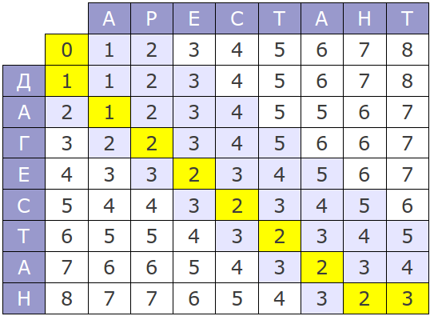

# TTProject
Damerau-Levenshteun Distance

Этот проект предназначен для того, что бы разобраться с алгоритмом сравнения строк Дамерау-Левенштейна.

Алгоритм основан на динамической формуле, тоесть мы заполняем двумерную таблицу растояниями для определенных частей слова.

Итерации алгоритма проходят слева направо сверху вниз, в итоге может выйти таблица вида: 

Я реализовал удобный графический интерфейс для данного алгоритма, что даст возможность понять его логику и попробовать реализовать самому. Инструкция по UI содержиться в самом графическом интерфейсе, так же есть поле для подсказок. Есть пошаговое выполнение алгоритма, что очень удобно. Сам интерфейс выглядит следующим образом:

Для более подробной информацией можете обратиться к презентации, оставленной в корневой папке репозитория
